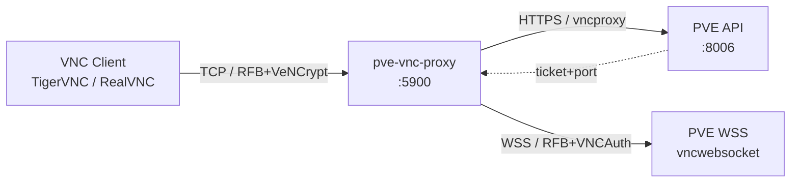
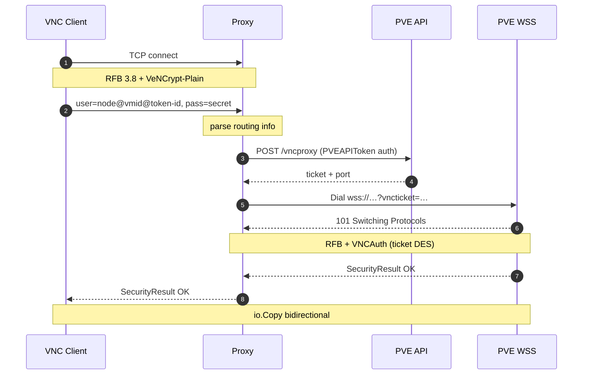
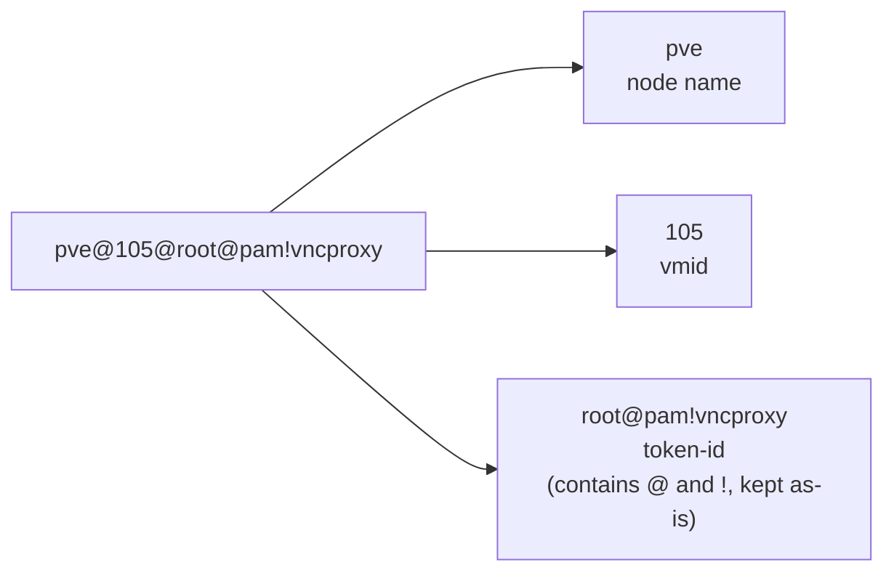

# pve-vnc-proxy

**English** | [中文](README.zh-CN.md)

Stateless PVE VNC proxy gateway. Bridges TCP connections from standard VNC clients (TigerVNC / RealVNC) to the Proxmox VE `vncwebsocket` endpoint, letting you reach any PVE VM console with a native VNC client — no browser, no noVNC.

## Features

- **Single port, multi-VM** — routing carried by the VNC client during handshake
- **Zero persisted credentials** — token supplied per-connection via VNC username/password
- **Protocol-level bridging** — RFB 3.8 + VeNCrypt-Plain on the client side, RFB + VNCAuth(ticket) upstream
- **Transparent forwarding** — plain `io.Copy` after handshake
- **Stdlib + `golang.org/x/net/websocket` only**

## Architecture



## Handshake flow



The proxy keeps no PVE credentials. All identity material is supplied by the VNC client at handshake time and discarded when the connection closes.

## Deploy

### Docker Compose (recommended)

```yaml
services:
  pve-vnc-proxy:
    image: ghcr.io/dreamhunter2333/pve-vnc-proxy:latest
    container_name: pve-vnc-proxy
    restart: unless-stopped
    ports:
      - "5900:5900"
    environment:
      PVE_HOST: https://pve.example.com:8006
      PVE_LISTEN: 0.0.0.0:5900
      # PVE_INSECURE: "true" # only for a self-signed PVE certificate
```

```bash
docker compose up -d
```

### Docker

```bash
docker run -d --name pve-vnc-proxy --restart unless-stopped \
  -p 5900:5900 \
  -e PVE_HOST=https://pve.example.com:8006 \
  ghcr.io/dreamhunter2333/pve-vnc-proxy:latest
```

If PVE uses its default self-signed certificate, also pass `-e PVE_INSECURE=true`. Prefer installing a trusted certificate instead of disabling verification in production.

Multi-arch images (`linux/amd64`, `linux/arm64`) are published to GHCR by GitHub Actions on every tag push.

### Build from source

```bash
go build -o pve-vnc-proxy .
PVE_HOST=https://192.168.2.200:8006 \
PVE_INSECURE=true \
PVE_LISTEN=127.0.0.1:5901 \
./pve-vnc-proxy
```

> On macOS, port `5900` is usually claimed by Screen Sharing — use `5901+` locally.

## Configuration

| Flag | Env var | Default | Description |
|------|---------|---------|-------------|
| `-host` | `PVE_HOST` | required | PVE address, e.g. `https://pve.example.com:8006`; `:8006` appended if no port |
| `-listen` | `PVE_LISTEN` | `127.0.0.1:5900` | Local TCP listen address |
| `-insecure` | `PVE_INSECURE` | `false` | Skip PVE TLS verification (self-signed certs) |
| `-max-conns` | `PVE_MAX_CONNS` | `256` | Max concurrent client connections |

## Create and authorize a PVE API Token

Keep **Privilege Separation** enabled and grant only the console permission for the required VM. A token's effective permissions cannot exceed those of its owning user; if the owner is not `root@pam`, that user also needs the corresponding permission.

### Web UI (recommended)

1. Go to `Datacenter` → `Permissions` → `API Tokens` → `Add`.
2. Select the user, enter the Token ID, leave **Privilege Separation** enabled, and save.
3. Immediately copy the full Token ID and Secret; the Secret is shown only once.
4. Go to `Datacenter` → `Permissions` → `Add` → `API Token Permission`.
5. Set Path to `/vms/<vmid>` (for example `/vms/105`), select the new token, and choose the `PVEVMUser` role.

`PVEVMUser` contains the required `VM.Console` privilege. To access every VM with the same token, use `/vms` as the Path; granting access per VM is safer.

### CLI

```bash
pveum user token add root@pam vncproxy -privsep 1
pveum acl modify /vms/105 -token 'root@pam!vncproxy' -role PVEVMUser
pveum user token permissions root@pam vncproxy
```

To intentionally inherit all permissions from the owning user, disable Privilege Separation. This is not recommended for highly privileged users:

```bash
pveum user token add root@pam vncproxy -privsep 0
```

## Connect with a VNC client

Point your VNC client (e.g. TigerVNC) at the proxy address (e.g. `localhost:5900`, or usually `localhost:5901` when running locally on macOS). Prepare the username and Secret first: client authentication must finish within 15 seconds after connecting, otherwise reconnect and try again.

### Username — concatenate three values with `@`

```
<node>@<vmid>@<token-id>
```

| Part | Where to find it | Example |
|------|------------------|---------|
| `<node>` | PVE Web UI left sidebar — the host under `Datacenter` | `pve` |
| `<vmid>` | The VM's numeric ID (also visible in the sidebar) | `105` |
| `<token-id>` | The full Token ID shown when creating the API token, in the form `user@realm!tokenname` — keep the `@` and `!` verbatim | `root@pam!vncproxy` |

**Final username**: `pve@105@root@pam!vncproxy`



### Password — the token secret

The password field is **just the token secret** — the UUID-looking string PVE shows once when the token is created (e.g. `xxxxxxxx-xxxx-xxxx-xxxx-xxxxxxxxxxxx`). No `PVEAPIToken=` prefix, no token-id repeated.

### Switching VMs

Change only the `<vmid>` part of the username. Same proxy, same token, no restart.

## Windows bidirectional clipboard

PVE's VNC clipboard requires **SPICE vdagent** inside the Windows guest. The QEMU Guest Agent alone is not sufficient, and no additional VNC server should be installed in Windows.

1. In the PVE Web UI, open the VM's `Hardware` → `Display` settings and set Clipboard to `VNC`. CLI example:

   ```bash
   qm set 105 -vga std,clipboard=vnc
   ```

   When using the CLI, replace `105` and `std` with the actual VMID and existing display type.
2. Inside the Windows guest, run the [Windows SPICE Guest Tools](https://www.spice-space.org/download/windows/spice-guest-tools/spice-guest-tools-latest.exe) installer as Administrator. It includes the SPICE agent and VirtIO Serial driver required for clipboard integration.
3. Restart Windows and reconnect the VNC client.
4. If synchronization still fails, verify that the VNC client accepts and sends clipboard updates. TigerVNC enables `AcceptClipboard` and `SendClipboard` by default.

This channel is primarily intended for text copy and paste; it does not provide file transfer.

## Troubleshooting

Check the proxy logs first; they never print the Token ID or Secret.

| Log or symptom | Cause and resolution |
|----------------|----------------------|
| `address already in use` | The listen port is occupied. On macOS, Screen Sharing commonly uses `5900`; set `PVE_LISTEN=127.0.0.1:5901` |
| `client handshake: ... i/o timeout` | Authentication was not completed within 15 seconds; prepare the username and Secret, then reconnect |
| `vncproxy http 401` | The Token ID or Secret is incorrect; the Token ID must contain the complete `user@realm!tokenname` |
| `vncproxy http 403` / `VM.Console` | The token cannot open this VM's console; grant `PVEVMUser` on `/vms/<vmid>` |
| `x509: certificate signed by unknown authority` | PVE uses a self-signed certificate; install the PVE CA, or set `PVE_INSECURE=true` only on a trusted network |
| `no route to host` / `connection refused` | The proxy process cannot reach `PVE_HOST:8006`; check the address, routing, and macOS Local Network permission |
| `wss dial failed` | The WebSocket/TLS connection failed; check the PVE address, certificate, and WebSocket support in any reverse proxy |

## Client compatibility

Requires VeNCrypt + Plain subtype support:

- ✅ TigerVNC (vncviewer)
- ✅ RealVNC Viewer
- ❌ Apple "Screen Sharing" (VNC Auth only)
- ❌ Older RealVNC Free (VNC Auth only)

## Security

- **TLS verification on by default** — set `-insecure` / `PVE_INSECURE=true` only for self-signed PVE certs
- **VeNCrypt-Plain is plaintext** — safe when bound to `127.0.0.1`; front with stunnel/SSH tunnel for external exposure
- **No persisted tokens** — credentials live only for the duration of one connection
- **15s handshake deadline** — slow-handshake DoS resistance
- **`-max-conns` cap** — overflow connections queue
- **Bounded upstream reads** — API body ≤ 1 MiB, RFB reason ≤ 4 KiB — OOM-resistant
- **Logs never include token/secret** — only node, vmid, remote address

## Limitations

- QEMU VMs only (`/nodes/{node}/qemu/{vmid}/vncproxy`); LXC would require `qemu` → `lxc` and is not implemented
- VNC client must support VeNCrypt-Plain
- The proxy itself does not terminate TLS — front with stunnel or similar if needed
