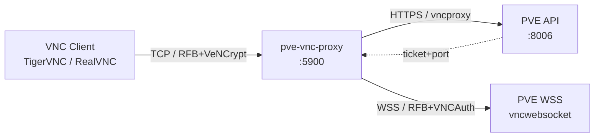
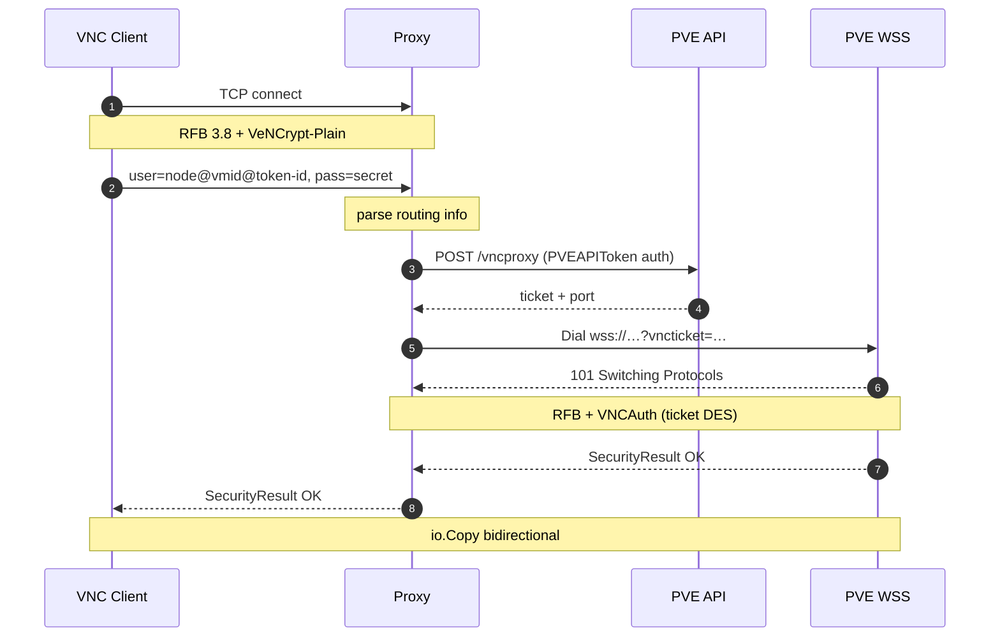
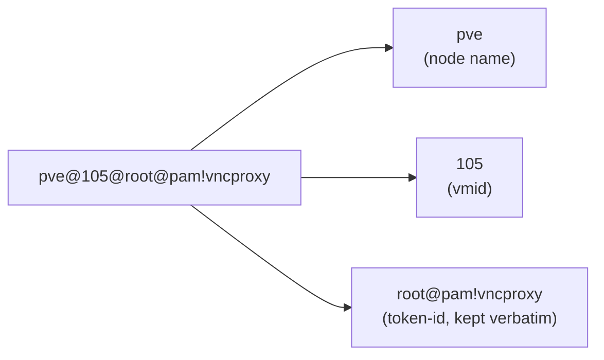

# pve-vnc-proxy

**English** | [中文](README.zh-CN.md)

Stateless PVE VNC proxy gateway. Bridges TCP connections from standard VNC clients (TigerVNC / RealVNC) to the Proxmox VE `vncwebsocket` endpoint, letting you reach any PVE VM console with a native VNC client — no browser, no noVNC.

## Features

- **Single port, multi-VM** — routing carried by the VNC client during handshake
- **Zero persisted credentials** — token supplied per-connection via VNC username/password
- **Protocol-level bridging** — RFB 3.8 + VeNCrypt-Plain on the client side, RFB + VNCAuth(ticket) upstream
- **Transparent forwarding** — plain `io.Copy` after handshake
- **Stdlib + `golang.org/x/net/websocket` only**

## Architecture



## Handshake flow



The proxy keeps no PVE credentials. All identity material is supplied by the VNC client at handshake time and discarded when the connection closes.

## Deploy

### Docker Compose (recommended)

```yaml
services:
  pve-vnc-proxy:
    image: ghcr.io/dreamhunter2333/pve-vnc-proxy:latest
    container_name: pve-vnc-proxy
    restart: unless-stopped
    ports:
      - "5900:5900"
    environment:
      PVE_HOST: https://pve.example.com:8006
      PVE_LISTEN: 0.0.0.0:5900
```

```bash
docker compose up -d
```

### Docker

```bash
docker run -d --name pve-vnc-proxy --restart unless-stopped \
  -p 5900:5900 \
  -e PVE_HOST=https://pve.example.com:8006 \
  ghcr.io/dreamhunter2333/pve-vnc-proxy:latest
```

Multi-arch images (`linux/amd64`, `linux/arm64`) are published to GHCR by GitHub Actions on every tag push.

### Build from source

```bash
go build -o pve-vnc-proxy .
PVE_HOST=https://pve.example.com:8006 ./pve-vnc-proxy -listen 127.0.0.1:5901
```

> On macOS, port `5900` is usually claimed by Screen Sharing — use `5901+` locally.

## Configuration

| Flag | Env var | Default | Description |
|------|---------|---------|-------------|
| `-host` | `PVE_HOST` | required | PVE address, e.g. `https://pve.example.com:8006`; `:8006` appended if no port |
| `-listen` | `PVE_LISTEN` | `127.0.0.1:5900` | Local TCP listen address |
| `-insecure` | `PVE_INSECURE` | `false` | Skip PVE TLS verification (self-signed certs) |
| `-max-conns` | `PVE_MAX_CONNS` | `256` | Max concurrent client connections |

## Create a PVE API Token

Web UI: `Datacenter` → `Permissions` → `API Tokens` → `Add`. **Uncheck** Privilege Separation, save, copy the Token ID and Secret (shown once).

Or on the PVE host:

```bash
pveum user token add root@pam vncproxy --privsep 0
```

If Privilege Separation stays enabled, grant ACL separately:

```bash
pveum acl modify /vms --tokens 'root@pam!vncproxy' --roles PVEVMAdmin
```

## Connect with a VNC client

Point your VNC client (e.g. TigerVNC) at the proxy address (e.g. `localhost:5900`):

| Field | Value | Example |
|-------|-------|---------|
| Username | `<node>@<vmid>@<token-id>` | `pve@105@root@pam!vncproxy` |
| Password | `<token-secret>` | `xxxxxxxx-xxxx-xxxx-xxxx-xxxxxxxxxxxx` |

Switch VMs by changing the `vmid` part of the username — no proxy restart needed.

### Username layout



The proxy splits on the first two `@` characters: node, vmid, then the rest is the token-id (which itself contains `@` and `!`).

## Client compatibility

Requires VeNCrypt + Plain subtype support:

- ✅ TigerVNC (vncviewer)
- ✅ RealVNC Viewer
- ❌ Apple "Screen Sharing" (VNC Auth only)
- ❌ Older RealVNC Free (VNC Auth only)

## Security

- **TLS verification on by default** — set `-insecure` / `PVE_INSECURE=true` only for self-signed PVE certs
- **VeNCrypt-Plain is plaintext** — safe when bound to `127.0.0.1`; front with stunnel/SSH tunnel for external exposure
- **No persisted tokens** — credentials live only for the duration of one connection
- **15s handshake deadline** — slow-handshake DoS resistance
- **`-max-conns` cap** — overflow connections queue
- **Bounded upstream reads** — API body ≤ 1 MiB, RFB reason ≤ 4 KiB — OOM-resistant
- **Logs never include token/secret** — only node, vmid, remote address

## Limitations

- QEMU VMs only (`/nodes/{node}/qemu/{vmid}/vncproxy`); LXC would require `qemu` → `lxc` and is not implemented
- VNC client must support VeNCrypt-Plain
- The proxy itself does not terminate TLS — front with stunnel or similar if needed
