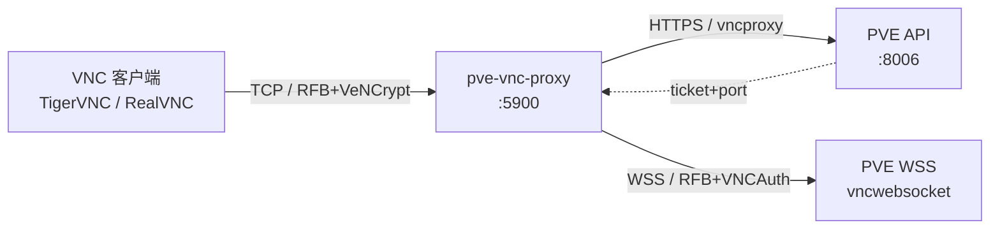
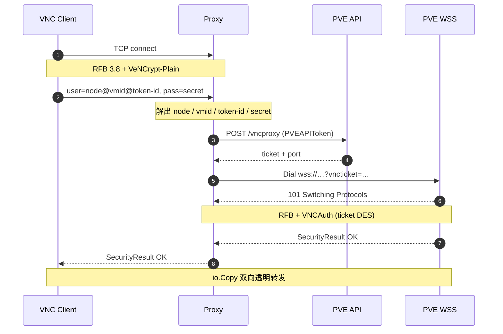
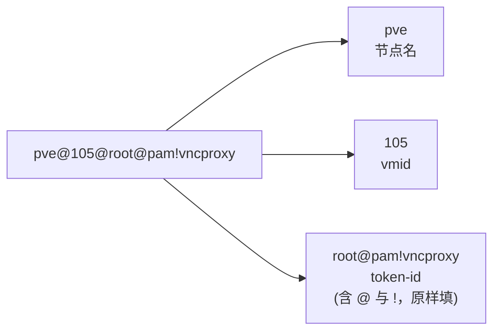

# pve-vnc-proxy

[English](README.md) | **中文**

无状态 PVE VNC 代理网关。把标准 VNC 客户端（TigerVNC / RealVNC）的 TCP 连接桥接到 Proxmox VE 的 `vncwebsocket` 端点，让你能用本地 VNC 客户端直接访问任意 PVE VM 的控制台，无需浏览器和 noVNC。

## 特性

- **单端口多 VM** — 路由信息由 VNC 客户端在握手时携带
- **零持久化凭证** — token 由客户端逐连接提供，代理不保存
- **协议级桥接** — 客户端侧 RFB 3.8 + VeNCrypt-Plain，上游侧 RFB + VNCAuth(ticket)
- **透明转发** — 握手完成后纯 `io.Copy` 双向桥接
- **仅依赖标准库 + `golang.org/x/net/websocket`**

## 架构



## 握手流程



代理不存储任何 PVE 凭证。所有身份信息由 VNC 客户端在握手时通过 VeNCrypt-Plain 的用户名/密码字段提供，连接关闭即弃。

## 部署

### Docker Compose（推荐）

```yaml
services:
  pve-vnc-proxy:
    image: ghcr.io/dreamhunter2333/pve-vnc-proxy:latest
    container_name: pve-vnc-proxy
    restart: unless-stopped
    ports:
      - "5900:5900"
    environment:
      PVE_HOST: https://pve.example.com:8006
      PVE_LISTEN: 0.0.0.0:5900
      # PVE_INSECURE: "true" # 仅用于 PVE 自签证书
```

```bash
docker compose up -d
```

### Docker

```bash
docker run -d --name pve-vnc-proxy --restart unless-stopped \
  -p 5900:5900 \
  -e PVE_HOST=https://pve.example.com:8006 \
  ghcr.io/dreamhunter2333/pve-vnc-proxy:latest
```

若 PVE 使用默认自签证书，额外传入 `-e PVE_INSECURE=true`。正式环境建议安装受信任证书，而不是关闭校验。

多架构镜像（`linux/amd64`、`linux/arm64`）由 GitHub Actions 在每次 tag push 时发布到 GHCR。

### 本地编译

```bash
go build -o pve-vnc-proxy .
PVE_HOST=https://192.168.2.200:8006 \
PVE_INSECURE=true \
PVE_LISTEN=127.0.0.1:5901 \
./pve-vnc-proxy
```

> macOS 上端口 `5900` 通常被 Screen Sharing 占用，本地建议用 `5901+`。

## 配置

| 参数 | 环境变量 | 默认值 | 说明 |
|------|----------|--------|------|
| `-host` | `PVE_HOST` | 必填 | PVE 地址，例 `https://pve.example.com:8006`；缺省端口自动补 `:8006` |
| `-listen` | `PVE_LISTEN` | `127.0.0.1:5900` | 本地 TCP 监听地址 |
| `-insecure` | `PVE_INSECURE` | `false` | 跳过 PVE TLS 校验（自签证书时启用）|
| `-max-conns` | `PVE_MAX_CONNS` | `256` | 最大并发客户端连接数 |

## 创建并授权 PVE API Token

推荐保留 **Privilege Separation**，只给 token 所需 VM 的控制台权限。Token 权限不会超过所属用户的权限；若不是 `root@pam`，所属用户也必须拥有对应权限。

### Web UI（推荐）

1. 进入 `Datacenter` → `Permissions` → `API Tokens` → `Add`。
2. 选择用户、填写 Token ID，保留 **Privilege Separation** 勾选并保存。
3. 立即复制完整 Token ID 与 Secret；Secret 只显示一次。
4. 进入 `Datacenter` → `Permissions` → `Add` → `API Token Permission`。
5. Path 填 `/vms/<vmid>`（如 `/vms/105`），选择刚创建的 token，Role 选 `PVEVMUser`。

`PVEVMUser` 包含代理所需的 `VM.Console` 权限。若要让同一 token 访问所有 VM，可将 Path 改为 `/vms`；按单个 VM 授权更安全。

### CLI

```bash
pveum user token add root@pam vncproxy -privsep 1
pveum acl modify /vms/105 -token 'root@pam!vncproxy' -role PVEVMUser
pveum user token permissions root@pam vncproxy
```

若明确希望 token 继承所属用户的全部权限，可关闭 Privilege Separation，但不推荐给高权限用户使用：

```bash
pveum user token add root@pam vncproxy -privsep 0
```

## 使用 VNC 客户端连接

VNC 客户端（如 TigerVNC）连接到代理地址（如 `localhost:5900`，macOS 本地运行通常为 `localhost:5901`）。请先准备好用户名和 Secret：客户端认证必须在连接建立后的 15 秒内完成，超时后需重新连接。

### 用户名 — 三段用 `@` 拼接

```
<node>@<vmid>@<token-id>
```

| 段 | 在哪里找 | 示例 |
|----|----------|------|
| `<node>` | PVE Web UI 左侧栏 `Datacenter` 下的主机名 | `pve` |
| `<vmid>` | VM 的数字 ID（左侧栏 VM 名称前的数字） | `105` |
| `<token-id>` | 创建 API Token 时看到的完整 Token ID，形如 `user@realm!tokenname`，**`@` 与 `!` 都要原样保留** | `root@pam!vncproxy` |

**最终用户名**：`pve@105@root@pam!vncproxy`



### 密码 — token secret

密码栏**只填 token secret 本身** — 创建 token 时 PVE 弹出的那个 UUID 字符串（如 `xxxxxxxx-xxxx-xxxx-xxxx-xxxxxxxxxxxx`）。不要加 `PVEAPIToken=` 前缀，也不要重复 token-id。

### 切换 VM

只改用户名里的 `<vmid>` 段。代理与 token 都不用动，也不必重启。

## Windows 双向剪贴板

PVE 的 VNC 剪贴板依赖 Windows Guest 内的 **SPICE vdagent**，不是 QEMU Guest Agent，也不需要在 Windows 中安装额外的 VNC Server。

1. 在 PVE Web UI 打开 VM 的 `Hardware` → `Display`，将 Clipboard 设置为 `VNC`。CLI 示例：

   ```bash
   qm set 105 -vga std,clipboard=vnc
   ```

   使用 CLI 时请将 `105` 和 `std` 替换为实际 VMID 与现有显示类型。
2. 在 Windows Guest 中以管理员身份安装 [Windows SPICE Guest Tools](https://www.spice-space.org/download/windows/spice-guest-tools/spice-guest-tools-latest.exe)。安装包包含剪贴板所需的 SPICE Agent 和 VirtIO Serial 驱动。
3. 重启 Windows，并重新连接 VNC。
4. 若仍无法同步，确认 VNC 客户端已启用发送和接收剪贴板；TigerVNC 默认启用 `SendClipboard` 与 `AcceptClipboard`。

该通道主要用于文本复制粘贴，不提供文件传输。

## 故障排查

先查看代理日志；日志不会打印 Token ID 或 Secret。

| 日志或现象 | 原因与处理 |
|------------|------------|
| `address already in use` | 监听端口被占用；macOS 常见是 Screen Sharing 占用 `5900`，改用 `PVE_LISTEN=127.0.0.1:5901` |
| `client handshake: ... i/o timeout` | 未在 15 秒内完成认证；准备好用户名和 Secret 后重新连接 |
| `vncproxy http 401` | Token ID 或 Secret 不正确；Token ID 必须包含完整的 `user@realm!tokenname` |
| `vncproxy http 403` / `VM.Console` | token 无权打开该 VM 控制台；在 `/vms/<vmid>` 上授予 `PVEVMUser` |
| `x509: certificate signed by unknown authority` | PVE 使用自签证书；安装 PVE CA，或仅在可信网络中设置 `PVE_INSECURE=true` |
| `no route to host` / `connection refused` | 代理进程无法访问 `PVE_HOST:8006`；检查地址、路由和 macOS“本地网络”权限 |
| `wss dial failed` | WebSocket/TLS 建连失败；检查 PVE 地址、证书以及中间反向代理是否支持 WebSocket |

## 客户端兼容性

需要支持 VeNCrypt + Plain 子类型：

- ✅ TigerVNC（vncviewer）
- ✅ RealVNC Viewer
- ❌ Apple "Screen Sharing"（仅 VNC Auth）
- ❌ 老版 RealVNC Free（仅 VNC Auth）

## 安全

- **TLS 校验默认开启** — 自签证书请显式 `-insecure` 或 `PVE_INSECURE=true`
- **VeNCrypt-Plain 明文凭证** — 仅绑定 `127.0.0.1` 时安全；对外暴露请加 stunnel/SSH tunnel
- **代理不持久化任何 token** — 凭证生命周期等同于单次连接
- **握手 15s 超时** — 抗慢速握手 DoS
- **`-max-conns` 上限** — 超出排队等待
- **上游响应大小受限** — API ≤ 1 MiB，RFB reason ≤ 4 KiB，防 OOM
- **日志不打印 token / secret** — 仅记录 node、vmid、远端地址

## 限制

- 仅支持 PVE QEMU VM（`/nodes/{node}/qemu/{vmid}/vncproxy`），LXC 容器需把路径里的 `qemu` 换成 `lxc`，目前未实现
- VNC 客户端必须支持 VeNCrypt-Plain
- 代理本身不终结 TLS，需要时请用 stunnel 等前置
