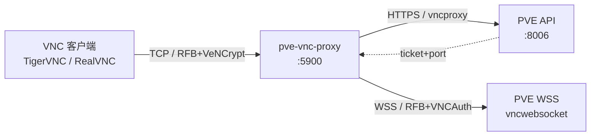
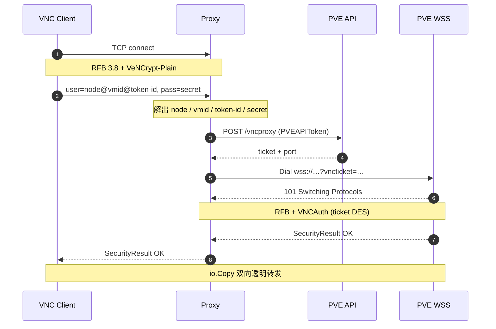
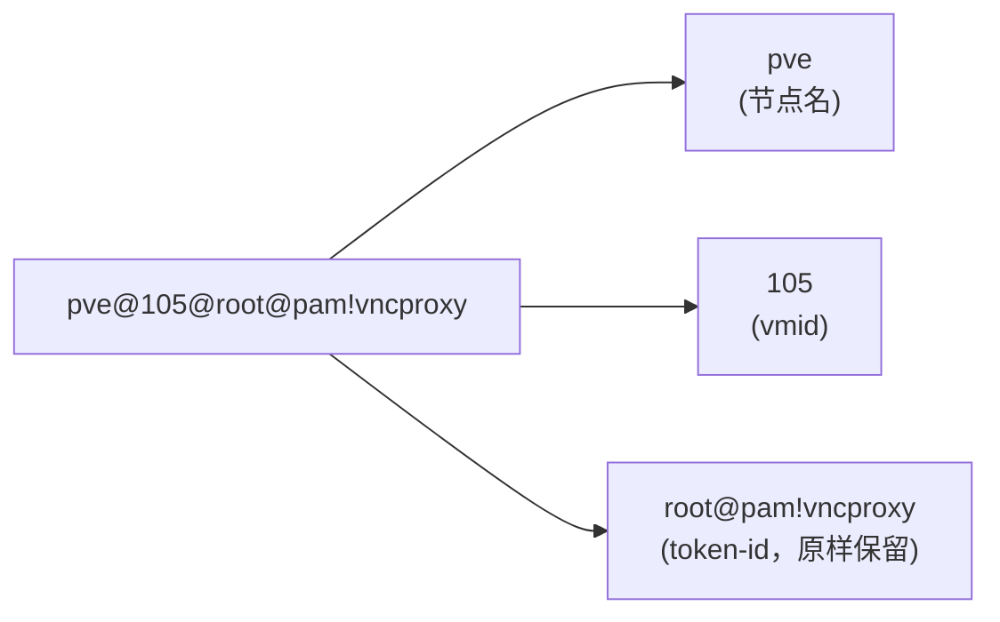

# pve-vnc-proxy

[English](README.md) | **中文**

无状态 PVE VNC 代理网关。把标准 VNC 客户端（TigerVNC / RealVNC）的 TCP 连接桥接到 Proxmox VE 的 `vncwebsocket` 端点，让你能用本地 VNC 客户端直接访问任意 PVE VM 的控制台，无需浏览器和 noVNC。

## 特性

- **单端口多 VM** — 路由信息由 VNC 客户端在握手时携带
- **零持久化凭证** — token 由客户端逐连接提供，代理不保存
- **协议级桥接** — 客户端侧 RFB 3.8 + VeNCrypt-Plain，上游侧 RFB + VNCAuth(ticket)
- **透明转发** — 握手完成后纯 `io.Copy` 双向桥接
- **仅依赖标准库 + `golang.org/x/net/websocket`**

## 架构



## 握手流程



代理不存储任何 PVE 凭证。所有身份信息由 VNC 客户端在握手时通过 VeNCrypt-Plain 的用户名/密码字段提供，连接关闭即弃。

## 部署

### Docker Compose（推荐）

```yaml
services:
  pve-vnc-proxy:
    image: ghcr.io/dreamhunter2333/pve-vnc-proxy:latest
    container_name: pve-vnc-proxy
    restart: unless-stopped
    ports:
      - "5900:5900"
    environment:
      PVE_HOST: https://pve.example.com:8006
      PVE_LISTEN: 0.0.0.0:5900
```

```bash
docker compose up -d
```

### Docker

```bash
docker run -d --name pve-vnc-proxy --restart unless-stopped \
  -p 5900:5900 \
  -e PVE_HOST=https://pve.example.com:8006 \
  ghcr.io/dreamhunter2333/pve-vnc-proxy:latest
```

多架构镜像（`linux/amd64`、`linux/arm64`）由 GitHub Actions 在每次 tag push 时发布到 GHCR。

### 本地编译

```bash
go build -o pve-vnc-proxy .
PVE_HOST=https://pve.example.com:8006 ./pve-vnc-proxy -listen 127.0.0.1:5901
```

> macOS 上端口 `5900` 通常被 Screen Sharing 占用，本地建议用 `5901+`。

## 配置

| 参数 | 环境变量 | 默认值 | 说明 |
|------|----------|--------|------|
| `-host` | `PVE_HOST` | 必填 | PVE 地址，例 `https://pve.example.com:8006`；缺省端口自动补 `:8006` |
| `-listen` | `PVE_LISTEN` | `127.0.0.1:5900` | 本地 TCP 监听地址 |
| `-insecure` | `PVE_INSECURE` | `false` | 跳过 PVE TLS 校验（自签证书时启用）|
| `-max-conns` | `PVE_MAX_CONNS` | `256` | 最大并发客户端连接数 |

## 创建 PVE API Token

Web UI：`Datacenter` → `Permissions` → `API Tokens` → `Add`，**取消勾选** Privilege Separation 后保存，复制 Token ID 与 Secret（只显示一次）。

或在 PVE 主机上：

```bash
pveum user token add root@pam vncproxy --privsep 0
```

若启用了 Privilege Separation，需另外授权：

```bash
pveum acl modify /vms --tokens 'root@pam!vncproxy' --roles PVEVMAdmin
```

## 使用 VNC 客户端连接

VNC 客户端（如 TigerVNC）连接到代理地址（如 `localhost:5900`）：

| 字段 | 内容 | 示例 |
|------|------|------|
| 用户名 | `<node>@<vmid>@<token-id>` | `pve@105@root@pam!vncproxy` |
| 密码 | `<token-secret>` | `xxxxxxxx-xxxx-xxxx-xxxx-xxxxxxxxxxxx` |

切换 VM 只需改用户名里的 `vmid`，无需重启代理。

### 用户名格式



代理在前两个 `@` 切两刀：第一段是节点名，第二段是 vmid，剩余全部当 token-id（其内部含 `@` 与 `!`）。

## 客户端兼容性

需要支持 VeNCrypt + Plain 子类型：

- ✅ TigerVNC（vncviewer）
- ✅ RealVNC Viewer
- ❌ Apple "Screen Sharing"（仅 VNC Auth）
- ❌ 老版 RealVNC Free（仅 VNC Auth）

## 安全

- **TLS 校验默认开启** — 自签证书请显式 `-insecure` 或 `PVE_INSECURE=true`
- **VeNCrypt-Plain 明文凭证** — 仅绑定 `127.0.0.1` 时安全；对外暴露请加 stunnel/SSH tunnel
- **代理不持久化任何 token** — 凭证生命周期等同于单次连接
- **握手 15s 超时** — 抗慢速握手 DoS
- **`-max-conns` 上限** — 超出排队等待
- **上游响应大小受限** — API ≤ 1 MiB，RFB reason ≤ 4 KiB，防 OOM
- **日志不打印 token / secret** — 仅记录 node、vmid、远端地址

## 限制

- 仅支持 PVE QEMU VM（`/nodes/{node}/qemu/{vmid}/vncproxy`），LXC 容器需把路径里的 `qemu` 换成 `lxc`，目前未实现
- VNC 客户端必须支持 VeNCrypt-Plain
- 代理本身不终结 TLS，需要时请用 stunnel 等前置
